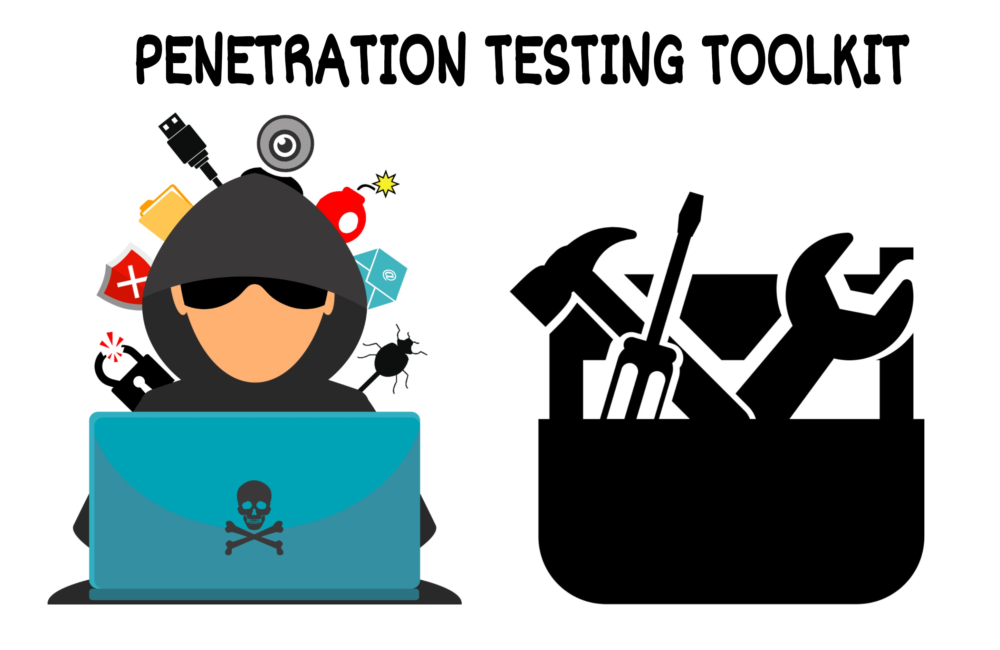

# Hack_Pack_V1.0

   

##  *Mega Combo of top selected hacking tools with description and working*    
   *Each tool is hand selected and verified as important tool for Pentration Testing and Bug Hunting.*
   *Boom! Lets get Started.*

### 1) dnscan https://github.com/rbsec/dnscan
####   -Description  
        dnscan is a python wordlist-based DNS subdomain scanner.  
        The script will first try to perform a zone transfer using each of the target domain's nameservers.
####   -Usage   
        dnscan.py (-d <domain> | -l <list>)  
          
          
### 2) Amass https://github.com/OWASP/Amass   
        The biggest subdomain enumerator and probably the slowest
####   -Description   
        The OWASP Amass Project performs network mapping of attack surfaces and external asset discovery using open source information gathering and active reconnaissance techniques.
####   -Usage 
       amass enum -d example.com        
        
        
### 3) Knockpy https://github.com/guelfoweb/knock
####   -Description  
        Knockpy is a python3 tool designed to enumerate subdomains on a target domain through dictionary attack.
####   -Usage   
        $ knockpy domain.com
          
### 4) Sublist3r https://github.com/aboul3la/Sublist3r
####   -Description  
        Sublist3r is a python tool designed to enumerate subdomains of websites using OSINT. It helps penetration testers and bug hunters collect, gather               subdomains for the targeted domain.
####   -Usage   
       To enumerate subdomains of specific domain and show only subdomains which have open ports 80 and 443 :
       python sublist3r.py -d example.com -p 80,443
       
NOTE- the output of the sublister needs to be passed from httpstatus.io to validate the results

### 5) massdns https://github.com/blechschmidt/massdns
####   -Description  
        MassDNS is a simple high-performance DNS stub resolver, targeting those who seek to resolve a massive amount of domain names in the order of millions or           even billions. 
####   -Usage   
       $ ./bin/massdns -r lists/resolvers.txt -t AAAA domains.txt > results.txt  
       Load all your domains in domain.txt
       
### 6) Sudomy https://github.com/Screetsec/Sudomy

####   -Description   
        Sudomy is a subdomain enumeration tool to collect subdomains and analyzing domains performing advanced automated reconnaissance (framework). This tool can         also be used for OSINT (Open-source intelligence) activities.
####   -Usage  
        To use all 22 Sources and Probe for working http or https servers (Validations):
        $ sudomy -d hackerone.com
         
### 7) nmap https://nmap.org
####   -Description    
        At a practical level, Nmap is used to provide detailed, real-time information on your networks, and on the devices connected to them.
####   -Usage   
       $nmap -A scanme.nmap.org
       $nmap -sV scanme.nmap.org
       
       
### 8) masscan https://github.com/robertdavidgraham/masscan
####   -Description  
        This is an Internet-scale port scanner. It can scan the entire Internet in under 5 minutes, transmitting 10 million packets per second, from a single              machine.It's usage (parameters, output) is similar to nmap, the most famous port scanner. When in doubt, try one of those features -- features that               support widespread scanning of many machines are supported, while in-depth scanning of single machines aren't.
####   -Usage    
        masscan -p80,8000-8100 10.0.0.0/8 2603:3001:2d00:da00::/112 --echo > xxx.conf
        
### 9) EyeWitness https://github.com/ChrisTruncer/EyeWitness
####   -Description  
        EyeWitness is designed to take screenshots of websites provide some server header info, and identify default credentials if known.
        Main key feature is about its addons and a html report file is created.
NOTE-   Aquatone could be better replacement for this.   

### 10) DirBuster https://sourceforge.net/projects/dirbuster/
####   -Description   
        DirBuster is a multi threaded java application designed to brute force directories and file names on web application servers.
####   -Usage   
       A java application is hence easy to use .
       
NOTE   -Dirsearch might be a better replacement for this, a command line tool.

### 11) Dirsearch https://github.com/maurosoria/dirsearch
####   -Description   
        "dirsearch" is a mature command-line tool designed to brute force directories and files in webservers.
####   -Usage    
        python3 dirsearch.py -u http://XXXXX/ -w db/worldlist.txt

### 12) Gitrob https://github.com/michenriksen/gitrob
####   -Description 
        Gitrob is a command line tool which can help organizations and security professionals find sensitive information lingering in publicly available files on GitHub. The tool will iterate over all public organization and member repositories and match filenames against a range of patterns for files that typically contain sensitive or dangerous information.
        Faced alots of issues while installing , use the beta release 
####   -Usage   
       gitrob [options] target [target2] ... [targetN]

### 13) sandcastle https://github.com/yasinS/sandcastle
####   -Description   
        A Python script for AWS S3 bucket enumeration, formerly known as bucketCrawler.The script takes a target's name as the stem argument (e.g. shopify) and iterates through a file of bucket name permutations, such as the ones below:
####   -Usage
        sandcastle.py [-h] -t targetStem 
       
### 14) bucket_finder https://digi.ninja/projects/bucket_finder.php
####   -Description   
        This is a fairly simple tool to run, all it requires is a wordlist and it will go off and check each word to see if that bucket name exists in the Amazon's S3 system. Any that it finds it will check to see if the bucket is public, private or a redirect.
####   -Usage   
       ./bucket_finder.rb my_words
       
### 15) Wayback Machine https://web.archive.org
####   -Description   
        A browser extension which quickly checks to by pass 404 page that might have previously stored in the machine.
####   -Usage   
       add the browser extension.
       
Bonus dork- site: http://www.target.com filetype:txt  

### 16) waybackurls https://gist.github.com/mhmdiaa/adf6bff70142e5091792841d4b372050 
####   -Description   
        Waybackurls fetch known URLs from the Wayback Machine for *.domain and output them on stdout. As wayback machine which stored urls of our target. Waybackurls r eturns as result a list of all the URLs that the Wayback Machine stored.
####   -Usage
        cat domains.txt | waybackurls > urls

### 17) fuff  https://github.com/ffuf/ffuf
####   -Description   
        An upraded version of Dirsearch. The only difference is, you cannot add custom parameters for bruteforcing in dirsearch. Prefer fuff over wfuzz because it's working documentary is available. This simple concept allows any input to be injected in any field of an HTTP request, allowing to perform complex web security attacks in different web application components such as: parameters, authentication, forms, directories/files, headers, etc.
####   -Usage   
       ffuf -w /path/to/wordlist -u https://target/FUZZ  

Tip- For more simplicity and better understanding use Burpsuite.      

### 18) XRay https://github.com/evilsocket/xray
####   -Description   
        XRay is a tool for network OSINT gathering, its goal is to make some of the initial tasks of information gathering and network mapping automatic.
####   -Usage   
        xray -shodan-key YOUR_SHODAN_API_KEY -domain TARGET_DOMAIN

### 19) Gau(GetallUrls) https://github.com/lc/gau
####   -Description   
        Getallurls (gau) fetches known URLs from AlienVault's Open Threat Exchange, the Wayback Machine, and Common Crawl for any given domain. Inspired by Tomnomnom's= waybackurls. One of the best tools for fuzzing. It is automation of going through Wayback Urls and detecting the fuzzing variables.  
        Finds all sensitive directory. Mixture of tools for finding sensitive directory hence best to use.
        
####   -Usage   
       gau example.com
       gau -o example-urls.txt example.com

### 20) ParamSpider https://github.com/devanshbatham/ParamSpider
####   -Description   
        Finds parameters from web archives of the entered domain. Finds parameters from subdomains as well. Gives support to exclude urls with specific extensions. Saves the output result in a nice and clean manner. It mines the parameters from web archives (without interacting with the target host).
####   -Usage   
        python3 paramspider.py --domain hackerone.com --level high
        python3 paramspider.py --domain hackerone.com

Tip- An excellent tool for begginers ,providing the output from Gau , Wayback Urls would make Your work completely automated. Giving you potential leads in no             time.

### 21) patator https://github.com/lanjelot/patator
####   -Description   
        A brute forcing tool for various services like FTP,SSh,SMTP,HTTP etc. It is a better replacement for tool Medusa , Metasploit, Hydra, Ncrack.
####   -Usage   
       ./patator.py ftp_login host=192.168.1.105 user=FILE0 password=FILE1 0=user.txt 1=passwords.txt

Tip-  Proper studying the ports from Nmap scan and using a proper, common wordlist can give you highly potential data.

### 22) datasploit https://github.com/DataSploit/datasploit
####   -Description   
        Performs OSINT (open source intelligence) on a domain / email / username / phone and find out information from different sources.
####   -Usage   
       python datasploit.py test.com

### 23) changeme https://github.com/ztgrace/changeme
####   -Description   
        changeme picks up where commercial scanners leave off. It focuses on detecting default and backdoor credentials and not necessarily common credentials.           It's default mode is to scan HTTP default credentials, but has support for other credentials.
####   -Usage   
       ./changeme.py 192.168.59.100
       ./changeme.py snmp://192.168.1.20
       
### 24) sqlmap http://sqlmap.org/
####   -Description   
        Sqlmap is an open source penetration testing tool that automates the process of detecting and exploiting SQL injection flaws and taking over of database            servers.
####   -Usage   
        sqlmap -u http://testphp.vulnweb.com/listproducts.php?cat=1 --dbs 
        sqlmap -u http://testphp.vulnweb.com/listproducts.php?cat=1 -D acuart --tables 
        for detailed use -https://www.geeksforgeeks.org/use-sqlmap-test-website-sql-injection-vulnerability/
        
### 25) oxml_xxe https://github.com/BuffaloWill/oxml_xxe/
####   -Description   
        This tool is meant to help test XXE vulnerabilities in OXML document file formats. Very old tool and hard to find vulenbrity.
####   -Usage   
        Run docker-compose up
        Browse to http://localhost:4567/ to get started.
        
### 26) XXE Injector https://github.com/enjoiz/XXEinjector
####   -Description   
        XXEinjector automates retrieving files using direct and out of band methods. Directory listing only works in Java applications. Bruteforcing method needs to be used for other applications.
####   -Usage   
        ruby XXEinjector.rb --host=192.168.0.2 --path=/etc --file=/tmp/req.txt –ssl
        
        
### 27) The JSON Web Token Toolkit https://github.com/ticarpi/jwt_tool
####   -Description   
        jwt_tool.py is a toolkit for validating, forging and cracking JWTs (JSON Web Tokens).This tool is written for pentesters, who need to check the strength            of the tokens in use, and their susceptibility to known attacks.
####   -Usage   
        python3 jwt_tool.py <JWT>
        
### 28) XSStrike https://github.com/s0md3v/XSStrike
####   -Description   
        XSStrike is a Cross Site Scripting detection suite equipped with four hand written parsers, an intelligent payload generator, a powerful fuzzing engine           and an incredibly fast crawler.
####   -Usage   
        python3 xsstrike.py -u https://target.com/id/
        
### 29) LFISuit https://github.com/D35m0nd142/LFISuite
####   -Description   
        LFI Suite is a totally automatic tool able to scan and exploit Local File Inclusion vulnerabilities using many different methods of attack,
####   -Usage   
        python lfisuite.py 
        Just run this and it will give you a user friendly interrface

### 30) gitfinder  https://github.com/guptabless/gitfinder
####   -Description   
        This python script also helps to search for the hidden git directory and dumps its contents.

####   -Usage   
        python git.py –u <URL>
        URL: where we want to search .git directory and we have to provide URL without http:/https or .git append.
        
### 31) GitTools https://github.com/internetwache/GitTools
####   -Description and usage
        Finder
        You can use this tool to find websites with their .git repository available to the public
        gitfinder.py [-h] [-i INPUTFILE] [-o OUTPUTFILE] [-t THREADS]
        The input file should contain the targets one per line    
        Dumper
        This tool can be used to download as much as possible from the found .git repository from webservers which do not have directory listing enabled.
        bash gitdumper.sh http://target.tld/.git/ dest-dir
        Git Extractor
        This is a script which tries to recover incomplete git repositories:
        bash extractor.sh /tmp/mygitrepo /tmp/mygitrepodump

Tip- Go through this blog for complete step wise usage of both this tools.

### 32) tko-subs https://github.com/anshumanbh/tko-subs
####   -Description   
        To check whether a subdomain can be taken over because it has:
        a dangling CNAME pointing to a CMS provider (Heroku, Github, Shopify, Amazon S3, Amazon CloudFront, etc.) that can be taken over.
####   -Usage   
        tko-subs -domain xxx.com  -data=providers-data.csv -output=output.csv
        tko-subs -domains=domains.txt -data=providers-data.csv -output=output.csv -takeover -githubtoken=<github-token> -herokuusername=<heroku-username> -               herokuapikey=<heroku-api-key> -herokuappname=<heroku-app-name>
        
### 33) Race the Web https://github.com/insp3ctre/race-the-web
####   -Description   
        https://www.slideshare.net/AaronHnatiw/racing-the-web-hackfest-2016
####   -Usage 
        race-the-web config.toml
        
### 34) ysoserial https://github.com/GoSecure/ysoserial
####   -Description   
        ysoserial is a collection of utilities and property-oriented programming "gadget chains" discovered in common java libraries that can, under the right             conditions, exploit Java applications performing unsafe deserialization of objects.
####   -Usage 
        java -jar ysoserial-0.0.4-all.jar CommonsCollections1 calc.exe | xxd
        
### 35) PHPGGC https://github.com/ambionics/phpggc
####   -Description   
        CORStest is a quick & dirty Python 3 tool to find Cross-Origin Resource Sharing (CORS) misconfigurations. It takes a text file as input which may contain a list of domain names or URLs. Currently, the following potential vulnerabilities are detected by sending a certain Origin request header and checking for the Access-Control-A
####   -Usage 
        corstest.py domains.txt
        
### 36) retire-js https://github.com/RetireJS/retire.js
####   -Description   
        Use the chrome and mozilla extesion checks for vulnerable , expired JavaScript libraries.
####   -Usage 
        Open the extension
        
### 37) getsploit https://github.com/vulnersCom/getsploit
####   -Description   
        Command line search and download tool for Vulners Database. just input the wordpress version and it will show possible vulnebrities.
####   -Usage 
        getsploit wordpress 5.8.0

### 38) Findsploit https://github.com/1N3/Findsploit
####   -Description   
        Findsploit is a simple bash script to quickly and easily search both local and online exploit databases. This repository also includes "copysploit" to copy         any exploit-db exploit to the current directory and "compilesploit" to automatically compile and run any C exploit .
####   -Usage 
        findsploit <search_term_1> <search_term_2> <search_term_3> ...

### 39) bfac https://github.com/mazen160/bfac
####   -Description   
        FAC (Backup File Artifacts Checker) is an automated tool that checks for backup artifacts that may disclose the web-application's source code.
####   -Usage 
        python3 bfac -u http://www.target.com/

### 40) tko-subs https://github.com/anshumanbh/tko-subs
####   -Description   
        A effective scanning tool for scanning vulenbrities in wordpress.
####   -Usage 
        Enumerate all plugins with known vulnerabilities
        wpscan --url example.com -e vp --plugins-detection mixed --api-token YOUR_TOKEN
        Enumerate all plugins in our database (could take a very long time)
        wpscan --url example.com -e ap --plugins-detection mixed --api-token YOUR_TOKEN
        To bypass some simple WAFs you can try the --random-user-agent option.
        
### 41) CMSMap https://github.com/Dionach/CMSmap
####   -Description   
        CMSmap is a python open source CMS scanner that automates the process of detecting security flaws of the most popular CMSs. The main purpose of CMSmap is         to integrate common vulnerabilities for different types of CMSs in a single tool.
####   -Usage 
       cmsmap.py https://example.com
             

Also added some Android Testing Tools
MobSF https://github.com/MobSF/Mobile-Security-Framework-MobSF/ 
Apktool https://github.com/iBotPeaches/Apktool
dex2jar https://sourceforge.net/projects/dex2jar/  
   
   
       
### Hoping to make it best, thus always open for contributions. You can open a new issue or pull me a request.  

## Contributors :

Atharva R. Hedage (atharavhedage@gmail.com)

Om Suryakant Koli (omkoli3600xt@gmail.com)

GitHub :
- [github.com/AtharavRH](https://github.com/AtharavRH)
- [github.com/omkoli](https://github.com/omkoli)

LinkedIn :
- [linkedin.com/atharavhedage](https://www.linkedin.com/in/atharavhedage/)
- [linkedin.com/omkoli](https://www.linkedin.com/in/omkoli/)

Instagram  :
- [instagram.com/atharav_rh](https://www.instagram.com/atharav_rh/)
- [instagram.com/0mkoli](https://www.instagram.com/0mkoli/)

**DISCLAIMER :- This repository is only for penetration testing and security research. I will not be responsible if you use it for any illegal activities.**

